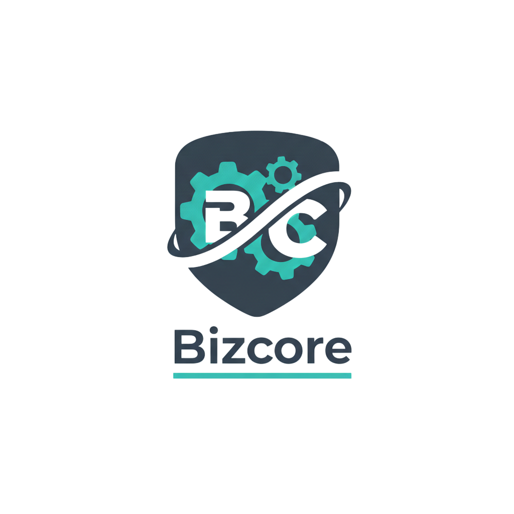

<p align="center">
  
</p>

<h1 align="center">BizCore — GestionCoach</h1>

<p align="center">
  Application desktop JavaFX de mise en relation entre entrepreneurs et coachs professionnels.
  <br/>
  <em>Projet académique — Connexion3A7 · Java 17 · JavaFX 17 · MySQL</em>
</p>

<p align="center">
  
  
  
  
  
  
</p>

---

## 📋 Table des matières

- [À propos](#-à-propos)
- [Fonctionnalités](#-fonctionnalités)
- [Architecture](#-architecture)
- [Prérequis](#-prérequis)
- [Installation](#-installation)
- [Configuration](#-configuration)
- [Lancement](#-lancement)
- [Structure du projet](#-structure-du-projet)
- [Base de données](#-base-de-données)
- [Tests](#-tests)
- [Technologies utilisées](#-technologies-utilisées)

---

## 🎯 À propos

**BizCore GestionCoach** est une application de bureau développée en JavaFX qui connecte des **entrepreneurs et startups** avec des **coachs professionnels** dans des domaines variés (Branding, Finance, Leadership, E-Commerce, Funding).

L'application propose deux interfaces distinctes :
- Un **dashboard Administrateur** pour gérer les coachs et consulter les statistiques de performance.
- Un **dashboard Utilisateur** pour parcourir les coachs disponibles, effectuer des réservations et interagir avec un chatbot IA.

---

## ✨ Fonctionnalités

### 👤 Côté Utilisateur
| Fonctionnalité | Description |
|---|---|
| 🔐 Authentification | Connexion sécurisée avec rôle `USER` ou `ADMIN` |
| 🃏 Catalogue des coachs | Cartes interactives avec filtre par domaine |
| 📅 Réservation | Sélection de disponibilité dans un calendrier hebdomadaire |
| ⭐ Notation | Système de rating des coachs après session |
| 🔔 Notifications | Centre de notifications in-app pour les réservations |
| 🤖 Chatbot IA | Assistant intelligent alimenté par Llama 3.1 (HuggingFace) |
| 📱 SMS | Confirmation de réservation par SMS (Twilio) |

### 🛠️ Côté Administrateur
| Fonctionnalité | Description |
|---|---|
| 📊 Dashboard | Vue globale avec statistiques et gestion des coachs |
| ➕ Ajout Coach | Formulaire complet avec détection automatique du pays (IP) |
| ✏️ Édition / Suppression | CRUD complet sur les coachs |
| 📈 Statistiques | Classement de performance pondéré (Occupation, Note, Fidélité, Tendance) |
| 📤 Export CSV | Export du tableau des coachs |

---

## 🏗️ Architecture

L'application suit une architecture **MVC (Model-View-Controller)** classique :

```
┌─────────────────────────────────────────────────────┐
│                  Couche Vue (FXML)                   │
│  login.fxml  dashboard.fxml  userDashboard.fxml ...  │
└────────────────────────┬────────────────────────────┘
                         │
┌────────────────────────▼────────────────────────────┐
│              Couche Controller (Java)                │
│  login  DashboardController  UserDashboardController │
│  AjouterCoach  ChatbotController  StatController     │
└────────────────────────┬────────────────────────────┘
                         │
┌────────────────────────▼────────────────────────────┐
│               Couche Service (Java)                  │
│  CoachService  ReservationService  ChatbotService    │
│  OkHttpSmsService  StatistiqueService  ...           │
└────────────────────────┬────────────────────────────┘
                         │
┌────────────────────────▼────────────────────────────┐
│             Base de données (MySQL)                  │
│                  bizcore (MariaDB)                   │
└─────────────────────────────────────────────────────┘
```

### Intégrations externes
```
Application ──► HuggingFace Router API  (Chatbot IA – Llama 3.1)
            ──► Twilio REST API          (Envoi SMS)
            ──► ipapi.co                (Détection pays par IP)
```

---

## 🔧 Prérequis

- **Java JDK 17** ou supérieur
- **Maven 3.6+**
- **MySQL / MariaDB** (version 8.x / 10.4+)
- Un compte **HuggingFace** (token gratuit) pour le chatbot
- Un compte **Twilio** (optionnel) pour les SMS

---

## 🚀 Installation

### 1. Cloner le dépôt

```bash
git clone https://github.com/<votre-organisation>/GestionCoach.git
cd GestionCoach
```

### 2. Créer la base de données

```bash
mysql -u root -p < src/main/java/edu/Connexion3A7/database/bizcore.sql
```

Ou via phpMyAdmin : importer le fichier `src/main/java/edu/Connexion3A7/database/bizcore.sql`.

### 3. Configurer la connexion MySQL

Ouvrir `src/main/java/edu/Connexion3A7/tools/MyConnection.java` et renseigner vos identifiants :

```java
private static final String URL = "jdbc:mysql://localhost:3306/bizcore";
private static final String USER = "root";
private static final String PASSWORD = "votre_mot_de_passe";
```

### 4. Configurer les APIs

Éditer `src/main/resources/config.properties` (voir section [Configuration](#-configuration)).

### 5. Installer les dépendances

```bash
mvn clean install
```

---

## ⚙️ Configuration

Le fichier `src/main/resources/config.properties` centralise toutes les clés d'API :

```properties
# ── Chatbot IA (HuggingFace) ──────────────────────────────────────────────
# Obtenez votre token gratuit sur : https://huggingface.co/settings/tokens
huggingface.api.key=hf_VOTRE_TOKEN_ICI
huggingface.api.url=https://router.huggingface.co/v1/chat/completions
huggingface.model=meta-llama/Llama-3.1-8B-Instruct:cerebras
huggingface.max.tokens=500
huggingface.temperature=0.7

# ── SMS Twilio (optionnel) ────────────────────────────────────────────────
# true = simulation locale (aucun SMS envoyé, aucun frais)
# false = envoi réel (requiert des credentials valides ci-dessous)
sms.test.mode=true

twilio.accountSid=ACxxxxxxxxxxxxxxxxxxxxxxxxxxxxxxxx
twilio.authToken=votre_auth_token
twilio.fromNumber=+1XXXXXXXXXX
twilio.toNumber=+216XXXXXXXX
```

> ⚠️ **Important** : Ne committez jamais ce fichier avec de vraies clés d'API. Ajoutez `config.properties` à votre `.gitignore` ou utilisez des variables d'environnement.

---

## ▶️ Lancement

### Via Maven

```bash
mvn javafx:run
```

### Via l'IDE (IntelliJ / Eclipse)

Exécuter la classe : `edu.Connexion3A7.tests.AppLauncher`

### Via le JAR compilé

```bash
mvn package
java --module-path /path/to/javafx-sdk/lib \
     --add-modules javafx.controls,javafx.fxml \
     -jar target/GestionCoach-1.0-SNAPSHOT.jar
```

---

## 📁 Structure du projet

```
GestionCoach/
├── src/
│   ├── main/
│   │   ├── java/edu/Connexion3A7/
│   │   │   ├── Controller/          # Contrôleurs JavaFX
│   │   │   │   ├── login.java
│   │   │   │   ├── DashboardController.java
│   │   │   │   ├── UserDashboardController.java
│   │   │   │   ├── AjouterCoach.java
│   │   │   │   ├── ChatbotController.java
│   │   │   │   └── StatController.java
│   │   │   ├── entities/            # Modèles de données (POJOs)
│   │   │   │   ├── coach.java
│   │   │   │   ├── user.java
│   │   │   │   ├── Reservation.java
│   │   │   │   ├── Disponibilite.java
│   │   │   │   ├── DomaineCoaching.java
│   │   │   │   └── DomaineNom.java  # Enum : BRANDING, E_COMMERCE, LEADERSHIP, FINANCE, FUNDING
│   │   │   ├── services/            # Logique métier
│   │   │   │   ├── CoachService.java
│   │   │   │   ├── ReservationService.java
│   │   │   │   ├── ChatbotService.java       # Intégration HuggingFace
│   │   │   │   ├── OkHttpSmsService.java     # Intégration Twilio
│   │   │   │   ├── IpDetectionService.java   # Détection pays via IP
│   │   │   │   ├── StatistiqueService.java
│   │   │   │   ├── DisponibiliteService.java
│   │   │   │   └── DomaineCoachingService.java
│   │   │   ├── interfaces/          # Contrats de services
│   │   │   │   ├── IService.java
│   │   │   │   └── IUserService.java
│   │   │   ├── dto/
│   │   │   │   └── CoachPerformanceDto.java  # DTO pour les stats
│   │   │   ├── tools/
│   │   │   │   └── MyConnection.java         # Singleton connexion MySQL
│   │   │   ├── database/
│   │   │   │   └── bizcore.sql               # Script de création BDD
│   │   │   └── tests/
│   │   │       ├── AppLauncher.java          # Point d'entrée principal
│   │   │       └── MainFx.java
│   │   └── resources/
│   │       ├── config.properties             # Configuration APIs
│   │       └── edu/Connexion3A7/Controller/
│   │           ├── login.fxml
│   │           ├── dashboard.fxml
│   │           ├── userDashboard.fxml
│   │           ├── ajouterCoach.fxml
│   │           ├── chatbotPanel.fxml
│   │           ├── stat.fxml
│   │           ├── style.css
│   │           └── images/
│   │               └── logo.png              # Logo Bizcore
│   └── test/
│       └── java/edu/Connexion3A7/services/
│           ├── CoachServiceTest.java
│           ├── ChatbotServiceTest.java
│           └── DomaineCoachingServiceTest.java
├── pom.xml
└── README.md
```

---

## 🗄️ Base de données

La base de données `bizcore` (MariaDB/MySQL) contient les tables principales suivantes :

| Table | Description |
|---|---|
| `users` | Comptes utilisateurs (email, mot de passe, rôle, téléphone) |
| `coach` | Profils des coachs (nom, domaine, tarif, expérience, note) |
| `domaine_coaching` | Domaines disponibles (BRANDING, E_COMMERCE, LEADERSHIP, FINANCE, FUNDING) |
| `reservation` | Réservations utilisateur ↔ coach (statut : CONFIRMEE / ANNULEE) |
| `disponibilite` | Créneaux de disponibilité des coachs |

Le script complet de création est disponible dans :
`src/main/java/edu/Connexion3A7/database/bizcore.sql`

---

## 🧪 Tests

Les tests unitaires sont écrits avec **JUnit 5** et couvrent la couche service :

```bash
# Lancer tous les tests
mvn test

# Lancer un test spécifique
mvn test -Dtest=CoachServiceTest
```

| Classe de test | Couverture |
|---|---|
| `CoachServiceTest` | CRUD complet sur les coachs |
| `ChatbotServiceTest` | Configuration et état du service chatbot |
| `DomaineCoachingServiceTest` | Gestion des domaines de coaching |

---

## 🛠️ Technologies utilisées

| Technologie | Version | Usage |
|---|---|---|
| Java | 17 | Langage principal |
| JavaFX | 17.0.14 | Interface graphique desktop |
| Maven | 3.x | Gestion de build et dépendances |
| MySQL / MariaDB | 8.x / 10.4 | Base de données relationnelle |
| OkHttp | 4.12.0 | Client HTTP (Twilio, HuggingFace, IP detection) |
| org.json | 20240303 | Parsing des réponses JSON |
| RxJava | 3.1.8 | Programmation asynchrone |
| JUnit Jupiter | 5.12.1 | Tests unitaires |
| HuggingFace API | — | Chatbot IA (Llama 3.1 8B Instruct) |
| Twilio REST API | — | Envoi de SMS de confirmation |
| ipapi.co | — | Géolocalisation par IP |

---

## 👥 Équipe

Projet développé dans le cadre de **Connexion3A7**.

---

## 📄 Licence

Ce projet est à usage académique.
## Contributors

| Name | Role |
|---|---|
| Islem Sekrani | Développeur — Module Gestion Coach |

---

## Academic Context

This module was developed as part of the **PIDEV** – 3rd Year Engineering Program  
at **Esprit School of Engineering – Tunisia**  
Academic Year: **2025–2026** | Class: **3A7**

---

## Acknowledgments

- **Esprit School of Engineering** for the academic framework
- **HuggingFace** for the free AI inference API
- **Twilio** for the SMS service
